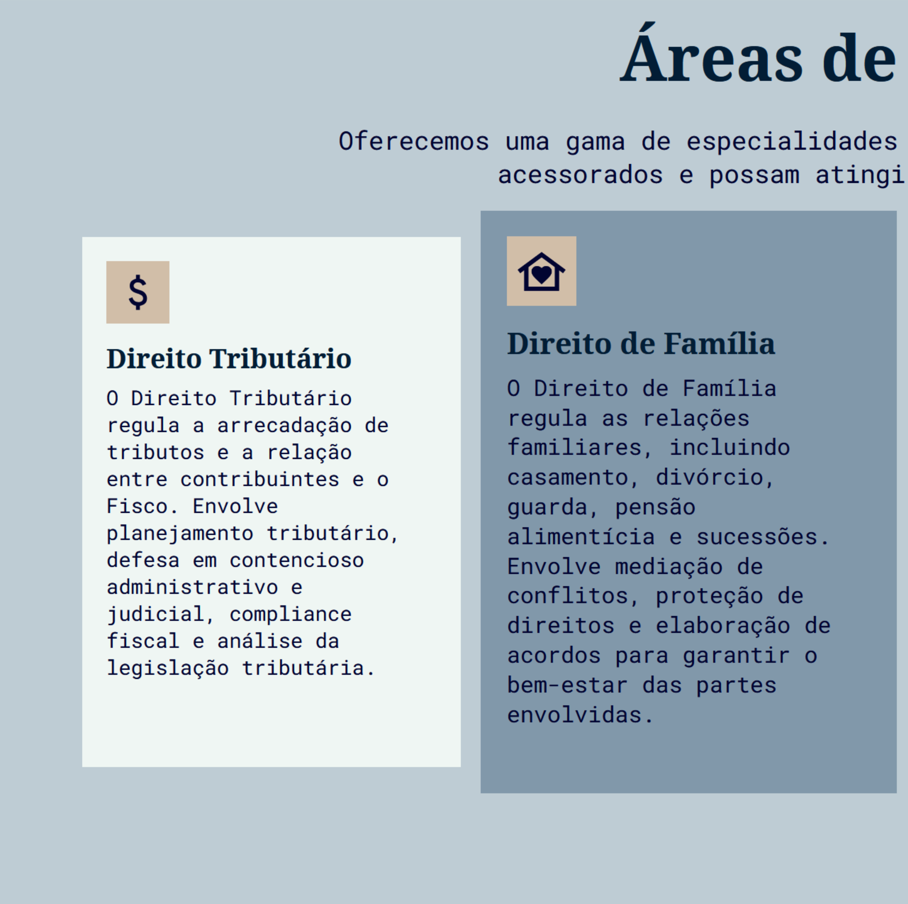

# Law_Website

<h1 align="center">
  
Acessar <a href="https://borges-camila.github.io/Law_Website/">aqui</a>

  
  
  
  
  
  
</h1>
 
- Projeto referente a uma página de escritório de advocacia.
- A base do projeto ainda está em andamento.

- Detalhes do projeto:

   

## Tecnologias

- Projeto elaborado utilizando HTML, CSS e JavaScript;

## Ferramentas

    <a href="https://reactjs.org/" target="_blank" rel="noreferrer">

## Como utilizar

- Você pode clonar o repositório
- Abrir os arquivos disponibilizados
